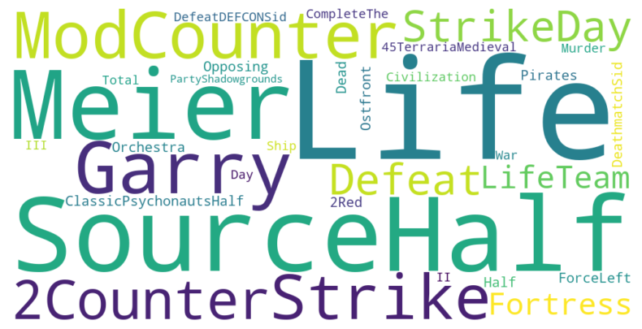
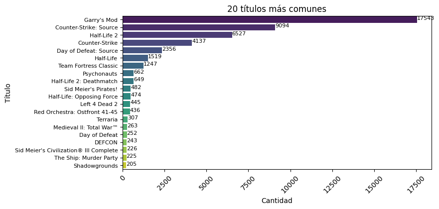
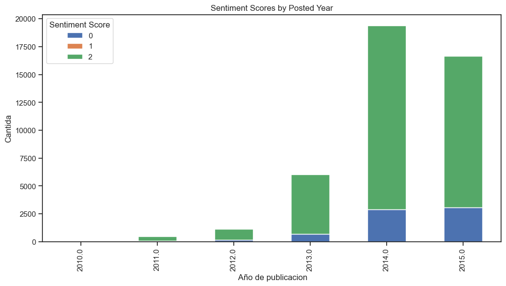
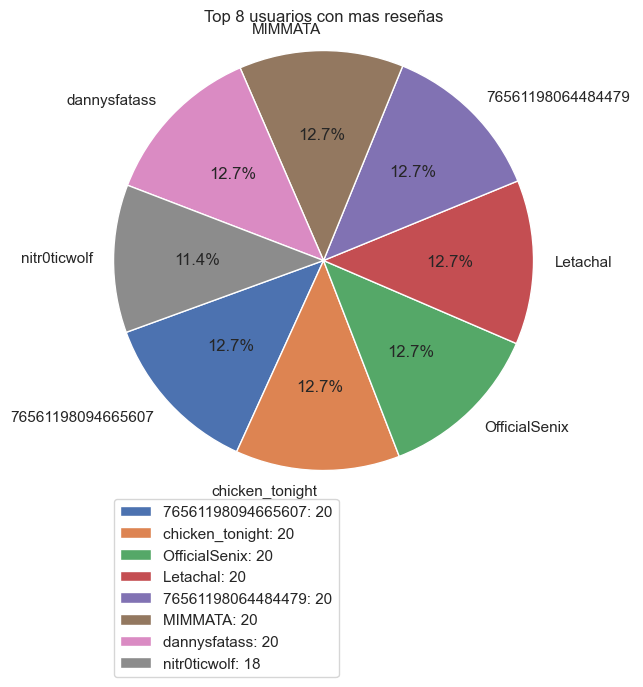

# Proyecto Individual 1 - Sistema de Recomendación de Videojuegos para Steam

Steam es una plataforma multinacional de videojuegos y plantea la tarea de crear un sistema de recomendacion de videojuegos. En el proyecto desarrollo las etapas de Ingeniería de Datos con procesos como ETL y EDA y Data Analytics respondiendo endpoint o preguntas de valor para el usuario, también se hace el despliegue de la API con el marco de referencia de FastAPI. El objetivo final es que los usuarios conozcan más de  cerca de los juegos, los más recomendados, los géneros que más les puedan interesar, un análisis de sentimiento de juegos y un modelo de Machine Learnig.

# Etapas del proyecto

El sistema se construye en tres etapas:

### 1. Ingeniería de Datos y Desarrollo de API

- **ETL:** Se realizó la carga y limpieza inicial, y organización del dataset para su correcta lectura. Se implementó un análisis de sentimiento  usando la herramienta 'SentimentIntensityAnalyzercon' creando la columna 'sentiment_score', permitiendo mejorar el rendimiento de la API con FastAPI y el entrenamiento del modelo de Machine Learning.

- **API 'endpoints':** Se propuso y desarrolló una API usando FastAPI que ofrece diversas consultas a los datos disponibles, brindando información sobre géneros, desarrolladores, usuarios, géneros y juegos.

### 2. EDA y Modelos de Machine learning

- **Analisis exploratorio:** Se realizó un análisis exploratorio de los datos como nube de nombres de juegos más comunes, frecuencia en las que estas palabras aparecen, correlación entre variables claves, y otras importantes para comprender mejor las relaciones entre las variables del dataset. Todas estas relaciones y datos sirven para análisis posteriores.

- **Modelos de Recomendación:** Se implementó el sistemas de recomendación 'ítem-ítem'. Este modelo permite sugerir juegos similares basados en la similitud entre ítems o juegos.

### 3. Deployment y Documentación

- **Deployment:** La API se encuentra desplegada y disponible para ser consumida desde la web, utilizando el servicio Render y siguiendo el tutorial disponible en el repositorio.

- **Readme.md:** Se documenta el desarrollo del proyecto en sus respectivas etapas para que el usuario final pueda entender la dinámica de la solución y los entregable.

- **Video explicativo:** Se desarrolla un video explicativo sobre el proyecto, el cual queda disponible en Yuotube

## --> ETL

La etapa del ETL es quizás la más importante en el desarrollo del proyecto toda vez que nos asegura la entrega de datos confiables y reutilizables para las etapas de anális y de entrenaniento en Machine Learning, además aseguramos en este proceso que los datos pueden ser reutilizados en análisis posteriores. Describo a continuación lo realizado.

`steam_games_consulta.csv`: Este dataset contiene información relativa a los juegos la cual se depuró dejando lo concerniente a 'géneros, app_name, fecha de lanzamiento, id y desarrollador'. En la base de datos original, se extrajeron los datos, se eliminaron las columnas sobrantes, se eliminaron filas completas con 100% de valores nulos y se dejaron solo las variables relevantes para los análisis.[ETL_tres_archivos.ipynb](ETL_tres_archivos.ipynb)

`user_reviews_consulta.csv`: Este dataset contiene información de las reseñas de los juegos, con información como id del usuario y los reviews; esta última columna es una variable anidada tipo json, la cual se desanidó para extraer la información relavante por cada usario. Se limpió el dataset y se dejaron los campos relevantes para el análisis como id del usario, fecha del posted, recomendación y review. También se uso la columna review para hacer análisis de sentimientos mediante la herramienta 'SentimentIntensityAnalyzercon' que permitió conocer el nivel de recomendación de los juegos con recomendado=2, no recomendado=0 y neutro=1. [ETL_tres_archivos.ipynb](ETL_tres_archivos.ipynb)

`australian_users_items_organizados.csv`: Esta base de datos contiene información sobre los usuarios, los juegos y las horas de juego. Se extrajo información relevante para el análisis como id del usuario, tiempo de juego, id de los juegos. [ETL_tres_archivos.ipynb](ETL_tres_archivos.ipynb)

Estos tres primeros archivos se dejaron separados, pues contienen información toda la información relevante para análisis posteriores.

`Dataset_final_numeros.csv`: Este conjunto de datos contiene información numérica tipo float, int para revisión en EDA de correlaciones entre variables. [ETL_tres_archivos.ipynb](ETL_tres_archivos.ipynb)

En resumen, cada archivo trabajado en el ETL quedó organizado y listo para ser usado y cargado sin inconvenientes en un Dataframe que se requiera para análisis.

## --> API 'endpoint'

### Deployment de la API

Se creó una API usando el módulo FastAPI con 5 funciones así:

+ 1. **PlayTimeGenre( *`genero` : str* )**:
    Devuelve `año` con mas horas jugadas para dicho género.

    En esta función recibe como entrada una cadena de texto con el género del juego y entrega el año con más horas jugadas para dicho género. Se usaron las bases de datos 'steam_games_cunsulta' y 'australian_users_items_organizados'. En 'steam_games_cunsulta' se busca el género del juego y luego con este dataset se consulta en 'australian_users_items_organizados' el año y las horas de juego. Para el tiempo de juego se estimó que la información de la base de datos era en minutos y los resultados se entregan en horas de juego.     
      
    Ejemplo de retorno: {"Año de lanzamiento con más horas jugadas para Género X" : 2013}
    
+ 2. **UserForGenre( *`genero` : str* )**:
    Esta función recibe como entrada una cadena de texto con el género del juego y entrega el usuario que acumula más horas jugadas para el género dado y una lista de la acumulación de horas jugadas por año.
    
    Se usaron las bases de datos 'steam_games_cunsulta' y 'australian_users_items_organizados'. En 'steam_games_cunsulta' se busca el género del juego y luego con este dataset se consulta en 'australian_users_items_organizados' el usuario con horas de juego y los años. 

    Ejemplo de retorno: {"Usuario con más horas jugadas para Género X" : us213ndjss09sdf,
			     "Horas jugadas":[{Año: 2013, Horas: 203}, {Año: 2012, Horas: 100}, {Año: 2011, Horas: 23}]}

+ 3. **UsersRecommend( *`año` : int* )**:
    Esta función recibe como entrada el año y entrega el top 3 de juegos más recomendados por usuarios en ese año. La recomendación es una variable que se generó basados en los reviews, calificando positivo =2, neutro =1 y negativo =0. Se usaron las bases de datos 'steam_games_cunsulta' y 'user_reviews_consulta'
    
    En 'steam_games_cunsulta' se busca el año y en 'user_reviews_consulta' las recomendaciones y los juegos más recomendados.
   
    Ejemplo de retorno: [{"Puesto 1" : X}, {"Puesto 2" : Y},{"Puesto 3" : Z}]

+ 4. **UsersWorstDeveloper( *`año` : int* )**:
   Esta función recibe como entrada el año y entrega el top 3 de desarrolladores con juegos menos recomendados por usuarios para el año dado. En este sentido se usó el 'sentiment score' = 0. Se usaron las bases de datos 'steam_games_cunsulta' y 'user_reviews_consulta' 
    
    En 'steam_games_cunsulta' se busca el año y en 'user_reviews_consulta' las recomendaciones y los desarrolladores menos recomendados.
   
    Ejemplo de retorno: [{"Puesto 1" : X}, {"Puesto 2" : Y},{"Puesto 3" : Z}]

+ 5. **sentiment_analysis( *`empresa desarrolladora` : str* )**:
    Esta función recibe como entrada el nombre de la empresa desarrolladora y entrega un diccionario con el nombre de la desarrolladora y una lista de la cantidad total de registros de reseñas de usuarios categorizados como Positivos, Negativos y Neutros.

    Se usaron las bases de datos 'steam_games_cunsulta' y 'user_reviews_consulta'. En 'steam_games_cunsulta' se busca la empresa desarrolladora y en 'user_reviews_consulta' las reseñas de usuarios.
      
    Ejemplo de retorno: {'Valve' : [Negative = 182, Neutral = 120, Positive = 278]}

# Análisis exploratorio 'EDA'

  

Se generó una nube de palabras con los juegos más comunes, además de análisis de frecuencia de los mismos.

  

## Análisis de sentimiento por año de publicación

  

## Usuarios con más reseñas

  

# Modelos de recomendación

- **sistema de recomendación** Se realiza un modelo con una relación ítem-ítem, esto es se toma un item, en base a que tan similar es ese ítem respecto al resto, se recomiendan similares. Aquí el input es un juego y el output es una lista de juegos recomendados, para ello se usó la  *similitud del coseno*.

+ def **recomendacion_juego( *`id de producto`* )**:
    Ingresando el id de producto, deberíamos recibir una lista con 5 juegos recomendados similares al ingresado.

# Deployment y Documentación

Accede a la API desplegada en [https://fastapi-jq5o.onrender.com].

Accede al entorno virtual de la API en [https://fastapi-jq5o.onrender.com/docs].

Link al video : [https://youtube.com/]

## Autor

Nombre : Héctor Ocampo Gaviria

GitHub : [https://github.com/hfocampo/PI_ML_OPS_Steam]

